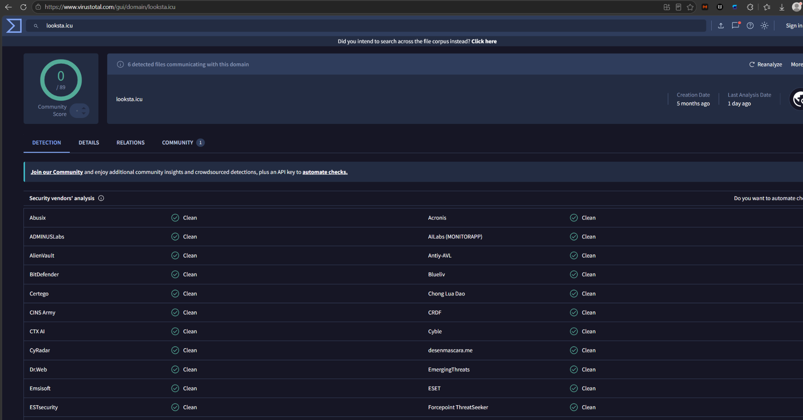
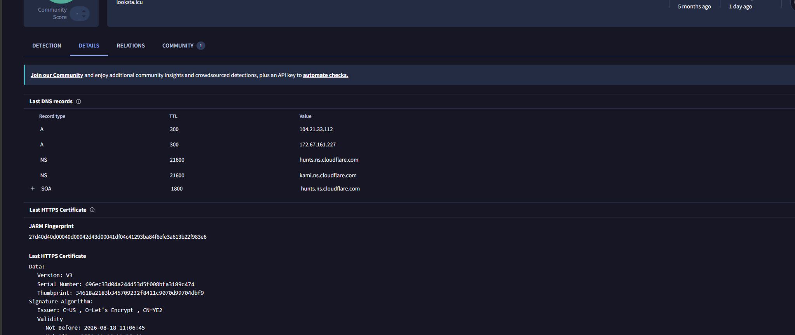
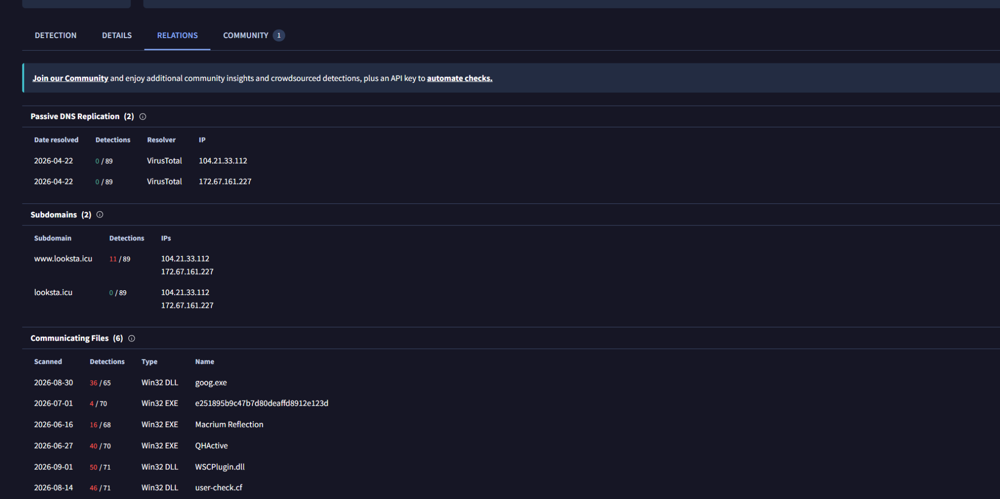
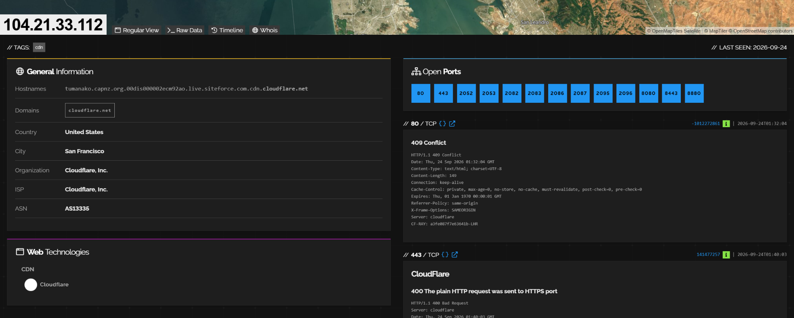
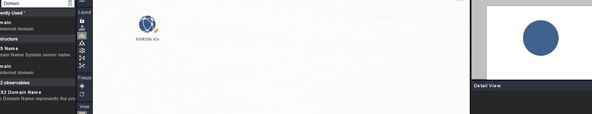

# Week 2 – Data Collection Process

## Project Topic

**Forensic Analysis and Detection of Simulated Infostealer-Like Activity in Windows Environments**

## Objective

The objective of Week 2 is to collect and analyze relevant external threat intelligence using OSINT sources.

The collected information is used to better understand infostealer-related indicators, infrastructure, and relationships before building the controlled Windows laboratory for later stages of the project.

## Hunting Question

**What publicly available indicators and threat intelligence can help us understand infostealer-related activity and identify useful data sources for future threat-hunting experiments?**

## Data Sources

The following OSINT tools and sources were used:

| Source | Purpose |
|---|---|
| VirusTotal | Analyze public information related to domains, files, hashes, URLs, and IP addresses |
| Shodan | Investigate publicly visible information about Internet-facing IP addresses and services |
| Maltego | Visualize relationships between indicators and related infrastructure |
| MITRE ATT&CK | Provide behavioral and adversary-technique context |
| Public security reports | Obtain documented indicators and information about infostealer activity |

## Data Collection Process

The Week 2 workflow was:

1. Select a publicly documented infostealer-related indicator from a reliable security report.
2. Analyze and enrich the indicator using VirusTotal.
3. Identify related IP addresses using passive DNS information.
4. Investigate relevant infrastructure using Shodan.
5. Use Maltego to visualize DNS and infrastructure relationships.
6. Compare information from multiple sources instead of treating a single reputation result as definitive evidence.
7. Document important observations and limitations.

## Selected Indicator

The domain `looksta[.]icu` was selected as the primary indicator for the Week 2 investigation.

The indicator was obtained from a public Microsoft Security Research report discussing ACR Stealer activity.

| Indicator | Type | Original Source |
|---|---|---|
| `looksta[.]icu` | Domain | Microsoft Security Research – ACR Stealer report |

## VirusTotal Analysis

VirusTotal was used to investigate the selected domain and related infrastructure.

At the time of analysis, the root domain `looksta.icu` showed **0/89 detections**. However, additional information showed that this result alone was not sufficient to classify the domain as safe.

VirusTotal also showed:

- multiple detected files communicating with the domain;
- a related `www.looksta.icu` hostname with detections;
- passive DNS relationships;
- associated IP addresses.

The following IP addresses were observed through passive DNS information:

- `104.21.33.112`
- `172.67.161.227`

Several communicating Windows executable or DLL files also showed detections in VirusTotal.

This demonstrated an important limitation of relying only on the detection score of a root domain. A zero detection count does not automatically mean that an indicator is safe. Related files, hostnames, infrastructure, and external threat intelligence should also be considered.

### VirusTotal – Detection

### VirusTotal – Relations

### VirusTotal – Details

## Shodan Analysis

The IP address `104.21.33.112` was investigated using Shodan.

Shodan identified the address as infrastructure belonging to:

- **Organization:** Cloudflare, Inc.
- **ASN:** AS13335

Several HTTP and HTTPS-related services and ports were visible in the Shodan results.

However, this information must be interpreted carefully. Cloudflare provides shared infrastructure for many different websites and services.

Therefore, the IP address cannot be directly attributed to the investigated threat actor or infostealer campaign.

The Shodan result was useful for understanding the infrastructure context, but not for direct attribution.

### Shodan – IP Analysis

## Maltego Analysis

Maltego was used to visualize relationships associated with `looksta.icu`.

The domain was added as the initial entity and a **Domain Name System (DNS) Lookup** transform was executed.

The resulting graph displayed DNS-related entities and infrastructure associated with the investigated domain.

Maltego was useful for visually representing relationships between the initial observable and related infrastructure.

The graph was treated as contextual information rather than proof that every connected entity was malicious or directly controlled by the same threat actor.

### Maltego – DNS Relationship Graph

## Data Source Mapping

| Data Type | Source | Use in the Project |
|---|---|---|
| Domain | VirusTotal / Maltego | Reputation, relationships, and infrastructure context |
| File | VirusTotal | Identify files communicating with investigated infrastructure |
| IP address | VirusTotal / Shodan / Maltego | Network and infrastructure context |
| ATT&CK technique | MITRE ATT&CK | Behavioral classification |
| Threat report | Microsoft Security Research and other public reports | Threat context and documented activity |
| Windows telemetry | Future controlled laboratory | Internal evidence for later threat-hunting and forensic analysis |

## Collected Indicators

| Indicator | Type | VirusTotal Result | Shodan Result | Maltego Result |
|---|---|---|---|---|
| `looksta[.]icu` | Domain | Root domain showed 0/89 detections, but related detected files and infrastructure were observed | Related IP infrastructure was associated with Cloudflare | DNS relationships were visualized |
| `104.21.33.112` | IP address | Observed through passive DNS | Cloudflare, Inc., AS13335 | Related infrastructure entity |
| `172.67.161.227` | IP address | Observed through passive DNS | Not investigated separately during the initial Shodan analysis | Related infrastructure entity |

## Key Findings

The OSINT investigation produced several useful observations:

- A single VirusTotal detection score should not be treated as a final verdict.
- Relationships with detected files and related hostnames can provide additional context.
- Passive DNS can identify infrastructure related to an investigated domain.
- Shared infrastructure such as Cloudflare limits the usefulness of an IP address for direct attribution.
- Maltego helps visualize relationships between indicators and infrastructure.
- Information from several sources should be correlated before drawing conclusions.

## Bridge to Future Threat Hunting

The external threat intelligence collected during Week 2 will later be used to guide the design of the controlled threat-hunting laboratory.

Public threat reports describe behaviors associated with infostealer activity, while VirusTotal, Shodan, and Maltego provide additional context about indicators and infrastructure.

For the later laboratory stage, only safe simulated behaviors will be reproduced using synthetic data. The project will not attempt to reproduce ACR Stealer or any other real infostealer exactly.

| Threat Intelligence Source | Documented or Relevant Behavior | Planned Safe Simulation | Future Evidence Source | Limitation |
|---|---|---|---|---|
| Public threat reports | Data collection and staging | Copy synthetic browser-like files into a staging directory | Windows telemetry and file artifacts | Simulation does not reproduce real credential theft |
| Public threat reports | Archive creation | Create an archive containing synthetic data | Process and file creation telemetry | Archive creation is also common in legitimate activity |
| Public threat reports | Network communication | Connect to a controlled local receiver | Windows network telemetry and receiver logs | A network connection alone does not prove that a specific file was transferred |
| VirusTotal / Shodan / Maltego | Indicator and infrastructure relationships | Use the collected OSINT as external context | Week 2 OSINT records | Related infrastructure does not automatically prove malicious ownership |

This connection allows the Week 2 OSINT results to provide context for later hypothesis-driven threat hunting without treating external indicators as sufficient evidence by themselves.

## Week 2 Result

During Week 2, OSINT sources were used to investigate a publicly documented infostealer-related indicator.

VirusTotal provided reputation, file, and passive DNS context. Shodan provided information about related Internet-facing infrastructure, while Maltego was used to visualize DNS relationships.

The investigation demonstrated the importance of source correlation. A single reputation score or IP address is not enough to make a reliable conclusion. Threat intelligence should be evaluated together with related indicators, infrastructure context, source reliability, and known limitations.

The collected information provides external threat context that can later support the design of controlled threat-hunting experiments in the Windows laboratory.
