# Week 4 – Cyber Kill Chain Analysis of an ACR Stealer Campaign

## Project topic and task

**Forensic Analysis and Detection of Simulated Infostealer-Like Activity in Windows Environments**

The Week 4 task is to analyze a real-world cyberattack through the seven stages of Lockheed Martin's Cyber Kill Chain and map the documented behavior to MITRE ATT&CK techniques. This report examines **Campaign 1** in [Microsoft Security Research's ACR Stealer report](https://www.microsoft.com/en-us/security/blog/2026/07/16/acr-stealer-two-observed-intrusion-chains-amid-increased-threat-activity/) (16 July 2026). Microsoft describes intrusions observed across customer environments from late April to mid-June 2026, rather than publishing one victim's complete forensic timeline. This is therefore a **campaign-level reconstruction**, not a claim that every behavior occurred on a single host.

The case continues the same IOC thread as [Week 2](week2-data-collection.md) and [Week 3](week3-data-processing.md): Microsoft's Campaign 1 IOC table labels `looksta[.]icu` a C2 domain. The analysis below uses Microsoft's observations for the attack behavior. Our local VirusTotal, Shodan, Maltego, and MISP records are separate evidence about the selected indicator; they are not evidence of an infection in our laboratory.

## Method and evidence key

The [Lockheed Martin intrusion kill chain](https://www.lockheedmartin.com/content/dam/lockheed-martin/rms/documents/cyber/LM-White-Paper-Intel-Driven-Defense.pdf) supplies the seven stages. The [Microsoft Campaign 1 account](https://www.microsoft.com/en-us/security/blog/2026/07/16/acr-stealer-two-observed-intrusion-chains-amid-increased-threat-activity/) supplies the observed behaviors. ATT&CK links below identify techniques that fit those behaviors; **the stage-to-technique placement is our analysis**, since ATT&CK tactics and Kill Chain stages are different classifications.

* **Reported:** the Microsoft Campaign 1 narrative explicitly describes the behavior.
* **Limited:** Microsoft describes a subset or a likely route, not every intrusion.
* **Not documented:** no stage-specific evidence in the cited account; no ATT&CK technique is invented to fill the gap.

```mermaid
flowchart LR
    R["1 Reconnaissance<br/>not documented"] --> W["2 Weaponization<br/>not documented"]
    W --> D["3 Delivery<br/>ClickFix and WebDAV"]
    D --> E["4 Exploitation<br/>user command and rundll32"]
    E --> I["5 Installation<br/>Python loader and task"]
    I --> C["6 Command and Control<br/>actor infrastructure"]
    C --> A["7 Actions on Objectives<br/>browser data and archive"]
    classDef unknown fill:#eeeeee,stroke:#777777,color:#111111;
    classDef reported fill:#dbeafe,stroke:#2563eb,color:#111111;
    class R,W unknown;
    class D,E,I,C,A reported;
```

*Figure 1. Analytical placement of Microsoft's Campaign 1 observations in the seven-stage model. Grey stages have no direct evidence in the report; arrows show model order, not a verified single-device timeline.*

## Stage-by-stage mapping

| Kill Chain stage | Campaign 1 evidence and confidence | Corresponding ATT&CK technique(s) | What the mapping does **not** establish |
| --- | --- | --- | --- |
| **1. Reconnaissance** | **Not documented.** Microsoft does not describe how the operators selected or researched targets before the ClickFix prompt. | **None assigned.** | A victim profile, scanning activity, or a target list cannot be reconstructed from this source. |
| **2. Weaponization** | **Not documented directly.** The later DLL, script, and loader show that payloads existed, but the report does not observe their development or packaging before delivery. | **None assigned.** | The existence of a payload is not proof of a particular build process or exploit kit. |
| **3. Delivery** | **Reported with a limited entry-route claim.** A ClickFix prompt instructs the user to run a command, which accesses a remote WebDAV-hosted DLL over HTTPS. Malvertising or manipulated search results are described as **likely**, not proven for a particular victim. | [T1204.004 – User Execution: Malicious Copy and Paste](https://attack.mitre.org/techniques/T1204/004/) describes the prompt-to-user-action boundary. | T1204.004 is an ATT&CK **Execution** technique, not an ATT&CK “Delivery” tactic. Neither an exact ad/search placement nor a particular WebDAV host is attributed to `looksta[.]icu` in the account. |
| **4. Exploitation** | **Reported.** The user-initiated command starts `cmd.exe`; `rundll32.exe` loads the remote DLL; the DLL starts obfuscated PowerShell. Here “exploitation” means the socially induced execution of attack code. | [T1059.003 – Windows Command Shell](https://attack.mitre.org/techniques/T1059/003/), [T1218.011 – Rundll32](https://attack.mitre.org/techniques/T1218/011/), and [T1059.001 – PowerShell](https://attack.mitre.org/techniques/T1059/001/). T1204.004 also spans the Delivery-to-Exploitation transition. | Microsoft does **not** claim exploitation of a CVE or software vulnerability in this chain. |
| **5. Installation** | **Reported.** PowerShell retrieves a ZIP stage under `%LocalAppData%\Temp`, launches a bundled `pythonw.exe` loader, and creates a hidden scheduled task for execution at user sign-in. | [T1059.006 – Python](https://attack.mitre.org/techniques/T1059/006/), [T1053.005 – Scheduled Task](https://attack.mitre.org/techniques/T1053/005/), and [T1105 – Ingress Tool Transfer](https://attack.mitre.org/techniques/T1105/) for the later ZIP download. | ATT&CK classifies T1105 under **Command and Control**, despite this Kill Chain placement. These are source-reported behaviors, not artifacts found on our Windows computer. |
| **6. Command and Control** | **Reported, with a subset variation.** The loaded DLL communicates with actor-controlled infrastructure. Microsoft's Campaign 1 IOC table lists `looksta[.]icu` as a C2 domain. In **some** intrusions, an additional loader uses blockchain services as a dead-drop resolver. | [T1102.001 – Web Service: Dead Drop Resolver](https://attack.mitre.org/techniques/T1102/001/) applies **only to that subset**. | The report does not tie blockchain resolution specifically to `looksta[.]icu`, or show that every Campaign 1 intrusion contacted it. |
| **7. Actions on Objectives** | **Reported.** The payload accesses browser-stored credentials, cookies, and tokens using DPAPI, enumerates documents, and archives collected data. | [T1555.003 – Credentials from Web Browsers](https://attack.mitre.org/techniques/T1555/003/) and [T1560 – Archive Collected Data](https://attack.mitre.org/techniques/T1560/). | The detailed Campaign 1 account presents archiving as **preparation for exfiltration**; it does not demonstrate a completed transfer through `looksta[.]icu`. |

Microsoft's ATT&CK summary table covers **both** ACR Stealer campaigns. The `mshta.exe` and JPEG-steganography chain in that table belongs to Campaign 2 and is intentionally excluded here. An ATT&CK technique can appear at more than one Kill Chain boundary; the mapping should be judged by the cited behavior, not by forcing a one-to-one sequence.

## Connection to the group project

| Existing work | Verified scope | How Week 4 uses it |
| --- | --- | --- |
| [Week 1 topic](week1-cti-fundamentals.md) | Selected infostealer-like activity and a future **safe simulation** direction. | Campaign 1 supplies a documented behavioral example for choosing defensive questions. |
| [Week 2 collection](week2-data-collection.md) | `looksta[.]icu` was selected from Microsoft; VirusTotal/Shodan provided passive-DNS and shared-infrastructure context; Maltego showed two NS relationships. | It identifies the same domain, but the two Cloudflare IPs and NS records do **not** prove the Campaign 1 execution chain or attacker ownership. |
| [Week 3 MISP review](week3-data-processing.md) | A real localhost MISP event stores the domain as a detection candidate and two contextual IPs with `to_ids=false`; the local correlation graph was empty. | The IOC remains traceable and qualified. MISP import is not evidence that ACR Stealer ran in the lab. |

The Week 4 increment is this **source-based attack model**. No malware was executed, no production indicator was contacted for this analysis, and no new Windows forensic telemetry or MISP correlations are claimed. It gives the next controlled-lab stage testable questions rather than pretending that a literature review is a detection result.

## Defensive questions for later controlled work

These are **proposed checks**, not completed experiments. Any later simulation should use synthetic files and local, controlled endpoints rather than the real C2 domain.

1. **Delivery and execution:** can process creation and RunMRU evidence distinguish an ordinary user command from a ClickFix-like `cmd.exe` → `rundll32.exe` sequence, particularly when a remote share is involved? Microsoft's report includes a RunMRU hunting example.
2. **Persistence:** can task-creation and process logs link a PowerShell-launched installer to a newly created user-logon task and later `pythonw.exe` execution?
3. **Objectives:** can an investigation connect unusual access to synthetic browser-like data with subsequent local archiving, while keeping benign archiving as a comparison case?

## Seven-to-eight-minute defense plan

| Time | Demonstrate or explain |
| --- | --- |
| 0:00–0:45 | State the Week 4 task, project topic, and why Microsoft's Campaign 1 is a real-world case related to the existing `looksta[.]icu` IOC. |
| 0:45–1:25 | Show Figure 1 and define the seven stages; explain that grey means “not documented.” |
| 1:25–4:45 | Walk through the seven table rows, spending most time on ClickFix → WebDAV/`rundll32` → PowerShell/Python → scheduled task → C2 → data collection. |
| 4:45–5:45 | Explain T1204.004, T1218.011, T1053.005, T1555.003, and T1560, and why ATT&CK tactics do not match Kill Chain stages one-to-one. |
| 5:45–6:50 | Show the Week 2 evidence and Week 3 MISP event as continuity for the IOC; distinguish this local work from Microsoft's attack observations. |
| 6:50–7:30 | State the limits: no observed recon/weaponization, no claimed CVE, blockchain is a subset, and archiving is not proof of completed exfiltration. Close with one proposed defensive check. |

## Sources and provenance

* Lockheed Martin, [*Intelligence-Driven Computer Network Defense Informed by Analysis of Adversary Campaigns and Intrusion Kill Chains*](https://www.lockheedmartin.com/content/dam/lockheed-martin/rms/documents/cyber/LM-White-Paper-Intel-Driven-Defense.pdf), section 3.2. Source of the seven stages and their definitions.
* Microsoft Security Research, [*ACR Stealer: Two observed intrusion chains amid increased threat activity*](https://www.microsoft.com/en-us/security/blog/2026/07/16/acr-stealer-two-observed-intrusion-chains-amid-increased-threat-activity/), 16 July 2026. Campaign 1 narrative and IOC table. Source accessed for this analysis on 1 October 2026.
* MITRE ATT&CK, technique pages linked in the table. Source of technique names, IDs, and definitions; their placement against this case is analytical.
* Repository [Week 2](week2-data-collection.md) and [Week 3](week3-data-processing.md) documentation and linked artifacts. Source of the group's own IOC handling; no claim of a local infection.

**Course-use disclosure:** Codex assisted with drafting and source checking this report. The group should confirm the instructor permits AI assistance and make the disclosure required by the syllabus before presenting or submitting it.
