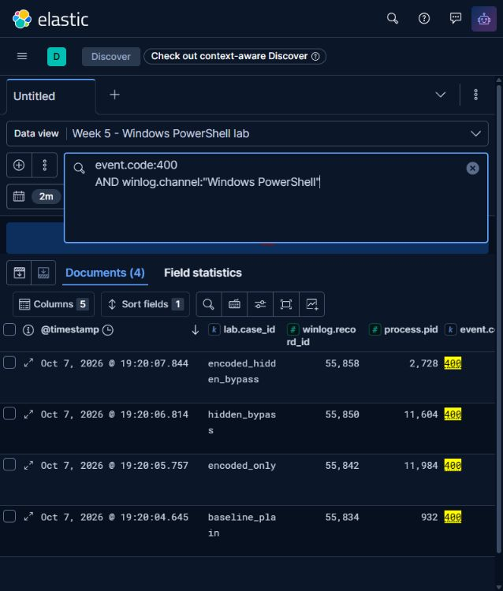
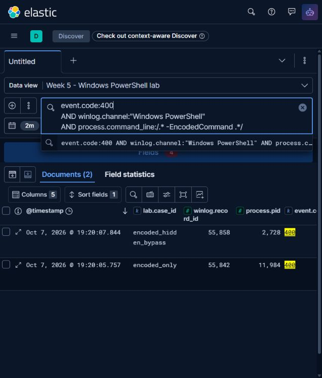
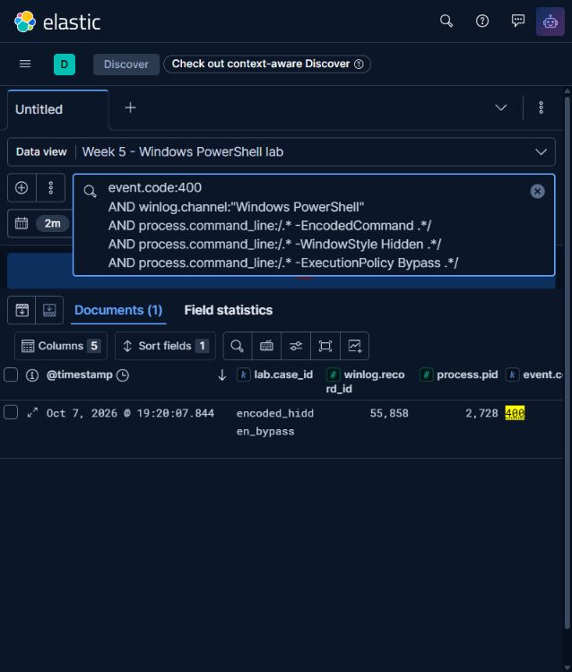

# Week 5 — Hypothesis-driven PowerShell hunt in the Elastic Stack

## Scope and continuity

The Week 5 task is to build a hypothesis-driven hunting scenario and execute hunt queries in Splunk or ELK. The recorded 7 October 2026 run used **Windows PowerShell 5.1.26100.9549** events from a controlled Windows host and a local **Elasticsearch 9.5.5 + Kibana 9.5.5** stack. A custom collector produced JSON Lines; a separate runner ingested them into Elasticsearch and executed three saved Query DSL hunts. Logstash and Winlogbeat were **not** deployed. The original collection, query responses, and Kibana screenshots are preserved below. A subsequent query correction and a replay workflow are described separately. This increment is prepared locally for group review; Practical validation is complete; the practice-teacher defense remains pending.

This follows the same project thread without asserting a new infection. Weeks 2–3 handled the `looksta[.]icu` indicator using external intelligence and MISP; Week 4 reconstructed Microsoft's published ACR Stealer Campaign 1. That [Microsoft report](https://www.microsoft.com/en-us/security/blog/2026/07/16/acr-stealer-two-observed-intrusion-chains-amid-increased-threat-activity/) describes an obfuscated PowerShell stage. It does **not** establish that Campaign 1 used the three launch flags tested below. The Week 5 cases are a generic, safe exercise in behavioral triage, not a replay of that campaign.

An **intelligence-driven hunt** starts with a known indicator or report; the earlier `looksta[.]icu` collection supplied intelligence for such a hunt while treating its Cloudflare IPs as context, not confirmed attacker endpoints. Weeks 2–3 did not execute an endpoint hunt. A **hypothesis-driven hunt** states a testable behavior before inspecting events. Here the expectation is: *among four controlled PowerShell launches, the combination of `-EncodedCommand`, `-WindowStyle Hidden`, and `-ExecutionPolicy Bypass` should produce fewer review candidates than `-EncodedCommand` alone.* A match calls for review, not a malware verdict.

## Controlled run and provenance

Run ID `79ae9ab54d6d413392107a14b93bef6b` took place on **7 October 2026, 14:20:04–14:20:09 UTC**. Each fresh `powershell.exe` process executed only `Write-Output` with a unique `W5LAB-...` marker. The encoded payloads contain that same harmless command in UTF-16LE Base64, as required by [Microsoft's `powershell.exe` documentation](https://learn.microsoft.com/en-us/powershell/module/microsoft.powershell.core/about/about_powershell_exe?view=powershell-5.1). No test command included network, file, credential, or exfiltration operations. `-ExecutionPolicy Bypass` was a launch argument in two cases; no blocked script or policy-bypass effect was tested.

The collector launched all four processes with hidden windows using `Start-Process -WindowStyle Hidden`. Only two cases included `-WindowStyle Hidden` in PowerShell's own command line. Therefore, this experiment compares command-line flag combinations, not actual window visibility.

| Case | Launch distinction | Event 400 RecordId | Process ID | Separate completion check | Observed Elasticsearch query membership |
| --- | --- | ---: | ---: | --- | --- |
| `baseline_plain` | Plain `-Command` | 55834 | 932 | Exit 0; case-specific marker on stdout | `inventory` only |
| `encoded_only` | `-EncodedCommand` | 55842 | 11984 | Exit 0; case-specific marker on stdout | `inventory`, `encoded_candidates` |
| `hidden_bypass` | `-WindowStyle Hidden` and `-ExecutionPolicy Bypass`, no encoding | 55850 | 11604 | Exit 0; case-specific marker on stdout | `inventory` only |
| `encoded_hidden_bypass` | All three flags | 55858 | 2728 | Exit 0; case-specific marker on stdout | All three saved queries |

The collector found **four distinct Event 400 records** in the classic `Windows PowerShell` channel. It mapped native `HostApplication` to `process.command_line` and added `lab.run_id` and `lab.case_id`. The JSONL preserves time, code, channel, RecordId, process ID, and command line. A read-only check counted four rows, four distinct cases, and four Event 400 values; both public artifact SHA-256 hashes matched the manifest. Event 400 supports **engine startup and collection**, while the separate stdout markers and exit codes support command completion. [Microsoft's logging guide](https://learn.microsoft.com/en-us/powershell/module/microsoft.powershell.core/about/about_eventlogs?view=powershell-5.1) distinguishes default engine lifecycle events from optional command logging.

Only `Event/System/Computer` and, when present, `Event/System/Security/@UserID` were redacted in the **published XML**; derived `host.name` is `LAB-WINDOWS-HOST`. Original XML remains outside the repository. The manifest records original and public hashes, times, RecordIds, stdout, and exit codes. Published XML is an evidence copy, not an unmodified original.

Host-path anonymization in the published `runtime.json` is documented separately in the [runtime redaction record](../evidence/week5/runtime-redactions.json). It does not change the collected XML, normalized event dataset, original query results, or screenshots.

| Artifact | Evidential role | Current state |
| --- | --- | --- |
| [Published XML](../evidence/week5/windows-events.xml) | Four minimally redacted native Event 400 records | Collected; hash checked |
| [Normalized JSONL](../data/week5-powershell-events.jsonl) | Four documents ingested into Elasticsearch | Collected; hash, row count, and resumed-index content checked |
| [Run manifest](../evidence/week5/run-manifest.json) | UTC times, process IDs, stdout/exit checks, original XML hashes, redactions | Collected |
| [Collector](../scripts/collect_week5_powershell.ps1) | Safe launches, native event collection, and evidence production | Executed for this run |
| [Compose file](../docker/week5-compose.yml) | Local Elasticsearch and Kibana configuration | Used for this run |
| [Original Query DSL](../evidence/week5/original-hunt-queries.json) | Exact query file used for the recorded 7 October searches | Preserved snapshot; this file matches the original results' query hash |
| [Current Query DSL](../data/week5-hunt-queries.json) and [hunt runner](../scripts/run_week5_hunt.py) | Revised queries and a separate replay workflow | Current source; subsequent executions must have their own outputs and hashes |
| [Hunt results](../evidence/week5/hunt-results.json) | Actual hit totals, case IDs, and complete Elasticsearch search responses | Captured |
| [API transcript](../evidence/week5/api-transcript.json) and [runtime](../evidence/week5/runtime.json) | Resumed-run API checks, mappings, service status, versions, ports, image IDs/digests | Captured; transcript has no initial Bulk response |
| [Inventory](../images/week5/kibana-inventory.jpg), [encoded candidates](../images/week5/kibana-encoded-candidates.jpg), and [refined hunt](../images/week5/kibana-refined-hunt.jpg) | Genuine Discover views of the same run, with query text, counts, cases, and RecordIds | Captured; observed 4 → 2 → 1 |

## Original hunt queries and results

The implemented path is **native Event 400 `HostApplication` → custom collector → JSONL → Elasticsearch Bulk API → Query DSL → Kibana**. It uses Elasticsearch and Kibana without Logstash. The recorded index `week5-powershell-79ae9ab54d6d413392107a14b93bef6b` held four documents, and its strict mapping stored `process.command_line` as a `wildcard` field. The [original queries](../evidence/week5/original-hunt-queries.json) filter `event.code="400"` and `winlog.channel="Windows PowerShell"`; the broad query finds `-EncodedCommand`, and the refined query adds case-insensitive wildcards for `-WindowStyle Hidden` and `-ExecutionPolicy Bypass`. Each original pattern requires a space after its matched flag or value. Independent [Boolean filters](https://www.elastic.co/docs/reference/query-languages/query-dsl/query-dsl-bool-query) permit different flag ordering only while that spacing condition holds; the original query misses `Hidden` or `Bypass` at the end of the command line. The revision below corrects this boundary condition. Kibana's original data view was recorded through its API and the [Discover](https://www.elastic.co/docs/explore-analyze/discover/) views below.

| Original saved query | Expected from source | Observed Elasticsearch hits and cases on 7 October |
| --- | ---: | --- |
| `inventory` | 4 | **4**: `baseline_plain`, `encoded_only`, `hidden_bypass`, `encoded_hidden_bypass` |
| `encoded_candidates` | 2 | **2**: `encoded_only`, `encoded_hidden_bypass` |
| `encoded_hidden_bypass` | 1 | **1**: `encoded_hidden_bypass` |

The three searches returned HTTP 200 with `timed_out=false`, successful shards, and the exact case IDs above on **7 October 2026 at 14:25:48 UTC**; the results file was finalized at 14:25:50 UTC. The index count was four, and the resumed runner compared the indexed documents with the four input records without rewriting them. Thus **the syllabus's query-execution requirement was performed**. These responses support the original query file, not later revisions. Leading wildcards can be expensive on larger indices; the queries test exact flag spelling and spacing, not aliases or shortened forms. No query uses `lab.case_id` to select a result; that field is only an annotation for verification.

**Recovery note:** The first run indexed and searched successfully but failed while recording runtime details because unauthenticated Kibana `/api/status` did not expose a version. The recovery revision used at the time read Kibana's version from `/usr/share/kibana/package.json` in the running container. Its `--resume-existing` run verified index contents against input without reindexing and repeated all three searches; `hunt-results.json` records `resumed_existing_index: true`. The published API transcript documents that resumed run and **does not contain the first Bulk response**. The recorded index count, content comparison, and search responses document the resulting indexed dataset without inventing a missing transcript.

Elasticsearch 9.5.5 was reported by `GET /`; Kibana 9.5.5 came from its running container's package file, while `/api/status` reported `available`. Docker Engine was 29.8.0 and Compose 5.5.1. The actual `elasticsearch:9.5.5` and `kibana:9.5.5` images were pulled from Docker Hub; their exact image IDs and digests are in `runtime.json`. Both containers were healthy. The HTTP ports were bound to loopback only: `http://127.0.0.1:9200` for Elasticsearch and `http://127.0.0.1:5601` for Kibana. Security is disabled in this local Compose setup, so the services must remain on loopback.

## Kibana verification of the original run

All three captures use the same data view and absolute time range **14:19–14:21 UTC on 7 October 2026**. Kibana renders event times in the host's UTC+05 time zone, so `19:20:07.844` in the table is `14:20:07.844 UTC` in the JSONL. RecordIds connect the visible rows to the native records.

Discover used this actual Lucene query for the refined view:

```text
event.code:400
AND winlog.channel:"Windows PowerShell"
AND process.command_line:/.* -EncodedCommand .*/
AND process.command_line:/.* -WindowStyle Hidden .*/
AND process.command_line:/.* -ExecutionPolicy Bypass .*/
```

The inventory uses the first two lines; the encoded-candidate view uses the first three. These UI regular-expression filters are case-sensitive and reproduce the original Query DSL results for the exact command lines in this run. The original DSL uses case-insensitive wildcards; the two forms are not claimed to be equivalent for every possible input. No lowercase-flag variant was tested in the original run. The following screenshots remain historical evidence of these original queries.

Inventory: **four** native engine-start events, with their case labels, RecordIds, and process IDs.



Encoded candidates: **two** rows, `encoded_only` (55842) and `encoded_hidden_bypass` (55858).



Refined hunt: **one** row, `encoded_hidden_bypass` (55858). This is a known benign control.



## Revised queries

Version 2 of [the current Query DSL](../data/week5-hunt-queries.json) accepts `-WindowStyle Hidden` and `-ExecutionPolicy Bypass` either before a space and another argument or at the end of the command line. Each flag-value pair uses a `bool.should` with `minimum_should_match: 1`: for example, `* -WindowStyle Hidden *` **or** `* -WindowStyle Hidden`. The same correction applies to `Bypass`. Matching remains case-insensitive in the DSL.

This fixes the known end-of-command omission while retaining a narrow scope: full canonical flag names, unquoted values, and single ordinary spaces. These are string-pattern queries, not a PowerShell argument parser; abbreviations, alternative whitespace, quoted values, and flag-like text inside a payload remain outside the validation claim. The tested flag-value pairs in the archived command lines already satisfied the original trailing-space condition, so the recorded 4 → 2 → 1 result is unaffected by this correction.

For manual Discover review of the revised pattern, select Lucene and use:

```text
event.code:400
AND winlog.channel:"Windows PowerShell"
AND process.command_line:/.* -EncodedCommand .*/
AND process.command_line:/.* -WindowStyle Hidden( .*)?/
AND process.command_line:/.* -ExecutionPolicy Bypass( .*)?/
```

The optional `( .*)?` permits either a space and the rest of the command or the end of the field after `Hidden`/`Bypass`. This Lucene example remains case-sensitive, unlike the DSL. It is a revised example, not the query displayed in the original screenshots. Use only the first two lines for inventory and the first three for encoded candidates.

## Replaying the archived dataset on a fresh machine

Install Docker Desktop, select its **Linux engine**, and have Python **3.9 or newer** available. The runner uses Python's standard library. Run these commands from the repository root:

```powershell
docker compose -f docker/week5-compose.yml up -d --wait
python scripts/run_week5_hunt.py --replay
```

Replay imports the archived JSONL, executes the current query file, creates a unique index and a matching Kibana data view, and saves new outputs under `evidence/week5-replays/<unique>/`. It does not launch PowerShell or collect new endpoint events. The new execution timestamp and current query hash belong to this replay; event timestamps and RecordIds still refer to the collection on **7 October 2026**. The original `evidence/week5/` records remain the evidence for the original run.

The runner prints the new index, data view, and output location. An optional `--output-dir` must name a directory that does not yet exist; replay refuses to reuse an existing output directory. Keep the emitted outputs together when sharing the new result.

Open `http://127.0.0.1:5601/app/discover`, choose the **data view printed by the replay**, and set the absolute interval to **7 October 2026, 14:19–14:21 UTC**, even when replay runs on a later date. On a UTC+05 display, that is **19:19–19:21** on the same date. Select Lucene and use the revised example above. Keep both service ports bound to loopback as supplied in the Compose file.

To repeat the searches against that replay index without reimporting data or replacing its recorded execution evidence, replace `INDEX_PRINTED_BY_REPLAY` below with the exact returned index name:

```powershell
python scripts/run_week5_hunt.py --query-only --index "INDEX_PRINTED_BY_REPLAY"
```

`--query-only` requires an existing populated index; it is not the first-run setup command. It uses the current `data/week5-hunt-queries.json`, so changing that file changes the queries on a later read-only check. The `hunt-queries.json` snapshot in each replay directory records the exact queries for that saved execution. Each fresh replay creates its own index and outputs, so a previous Docker volume is not required for the initial recipe.

### Current verification results

On **8 October 2026**, revision 2 was executed on a newly created Docker volume with Elasticsearch and Kibana 9.5.5. The [new replay results](../evidence/week5-replays/2026-10-08-validation/hunt-results.json) again contain **4 → 2 → 1** hits, and the [new API transcript](../evidence/week5-replays/2026-10-08-validation/api-transcript.json) includes index creation, the successful initial Bulk import, all three searches, and creation of the matching Kibana data view. This reuses the four collected events; it is not a new endpoint collection. The [query snapshot](../evidence/week5-replays/2026-10-08-validation/hunt-queries.json) and runner hash identify the code and queries used.

The offline suite passed **32 tests**, with the opt-in live test skipped in that invocation. The live test was then run separately and passed against Elasticsearch using **21 synthetic command-line fixtures**: six permutations, their six lowercase variants, seven near-miss controls, and two event/channel exclusions. Expected DSL totals were **19 / 17 / 12**; the case-sensitive Lucene example matched the six canonical-case permutations. These counts belong to synthetic regression inputs, not the four collected events. The original DSL misses eight of the positive fixtures, and revision 2 fixes those omissions. See the [actual synthetic API responses](../evidence/week5-validation/query-regression.json) and [validation summary](../evidence/week5-validation/validation-summary.json).

Commands used for the successful replay and offline suite:

```powershell
python -B scripts/run_week5_hunt.py --replay --output-dir evidence/week5-replays/2026-10-08-validation
python -B -m unittest discover -s tests -v
```

That named output directory is included in this repository and now exists; use plain `--replay` or a different new `--output-dir` for your own run. To repeat only the live regression test on the local stack:

```powershell
$env:WEEK5_TEST_ELASTICSEARCH = 'http://127.0.0.1:9200'
python -B -m unittest discover -s tests -k live_elasticsearch -v
```

The regression test creates and removes its own synthetic index. To save another regression report, set `WEEK5_TEST_REPORT` to a new file path; existing reports are protected. A subsequent `--query-only --index` check of the replay also returned **4 → 2 → 1**, with hashes of the original and replay evidence unchanged. The original 7 October screenshots remain historical; no new screenshot is claimed for the replay.

The PowerShell collector deliberately refuses to replace existing collection evidence. A new collection is a new run with new times and RecordIds and must be documented separately. The original run's `--resume-existing` recovery is historical context, not the procedure for replaying the supplied archive.

## Interpretation and limitations

All four collected cases are intentionally **benign**. The refined case has all three flags but is not a malicious ground-truth positive. Encoding can serve ordinary quoting needs, a hidden window can serve automation, and `-ExecutionPolicy` changes the current session rather than proving evasion. The original run includes no background sample, false-positive or false-negative estimate, alias test, or infection claim. The local classic event log is useful here but is not tamper-proof forensic evidence. No production IOC was contacted and no exfiltration occurred.

The practical value of the hunt is a reproducible process: form a limited hypothesis, run controls, preserve native evidence, search a documented field, inspect the actual hits, and qualify what those hits mean. It extends [Week 4's PowerShell-stage analysis](https://www.microsoft.com/en-us/security/blog/2026/07/16/acr-stealer-two-observed-intrusion-chains-amid-increased-threat-activity/) without claiming that the laboratory flags are an ACR Stealer signature. The general behavior category is consistent with [MITRE ATT&CK T1059.001 — PowerShell](https://attack.mitre.org/techniques/T1059/001/); that mapping is a conceptual reference, not a malware attribution.

## Seven-to-eight-minute defense outline

| Time | Material to show |
| --- | --- |
| 0:00–0:50 | State the syllabus task and the Weeks 1–4 continuity. Distinguish IOC-led from hypothesis-led hunting. |
| 0:50–2:00 | State the exact three-flag hypothesis and show the four benign controls. |
| 2:00–3:15 | Show one native Event 400 XML record, its `HostApplication`, and the corresponding JSONL document and manifest entry. |
| 3:15–5:30 | Show the original Query DSL, recorded Elasticsearch 4 → 2 → 1 responses, and the three original Kibana screenshots. Explain the current boundary correction and keep any replay results separate. |
| 5:30–6:35 | Explain why a matching benign launch is a triage candidate, not a detection of ACR Stealer. |
| 6:35–7:30 | Cover limits, evidence provenance, and the next defensible improvement: test aliases and ordinary background activity. |

**AI-use disclosure:** Codex assisted with hypothesis design, scripts and queries, source review, execution orchestration, and documentation. The group should review the final artifact and follow the course's AI-use disclosure requirements before submission. No claim is made that the practice-teacher defense has already taken place.
